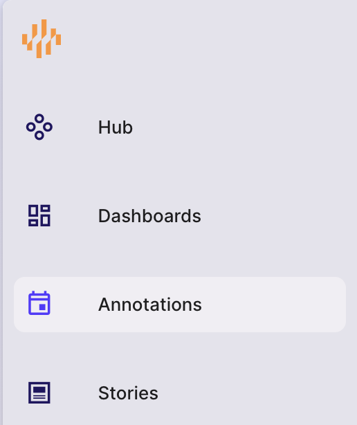
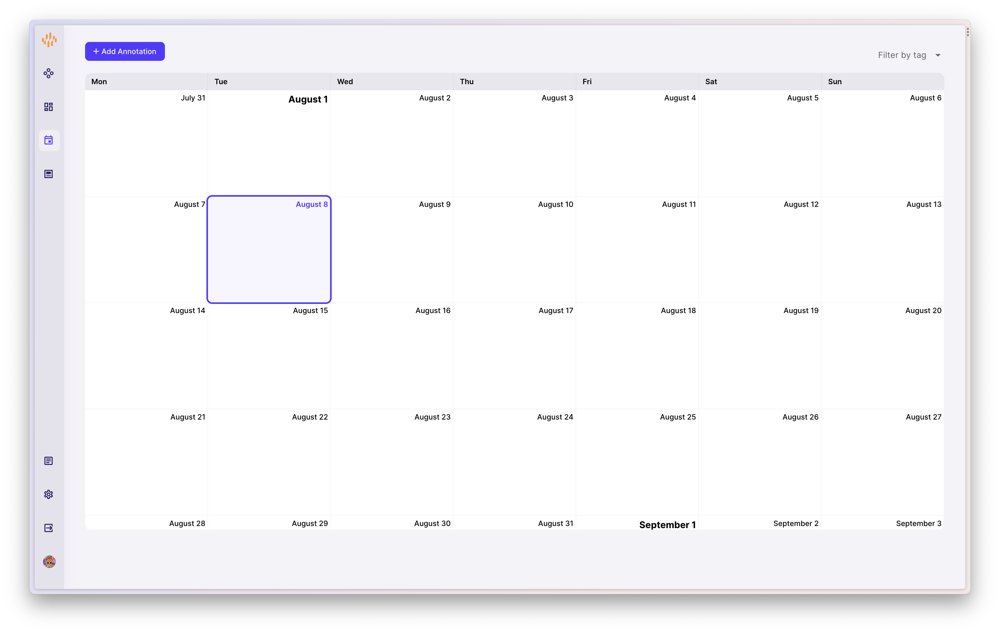
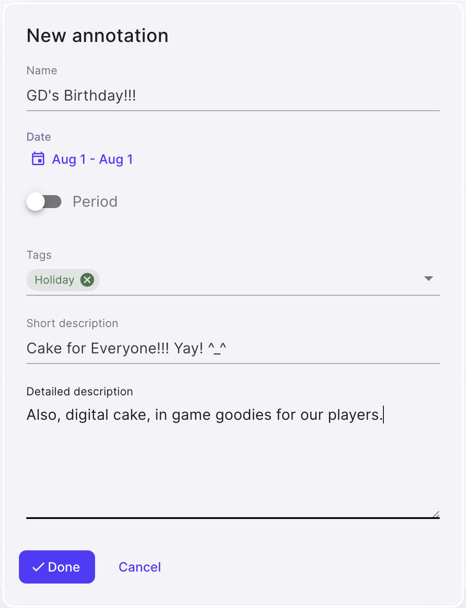
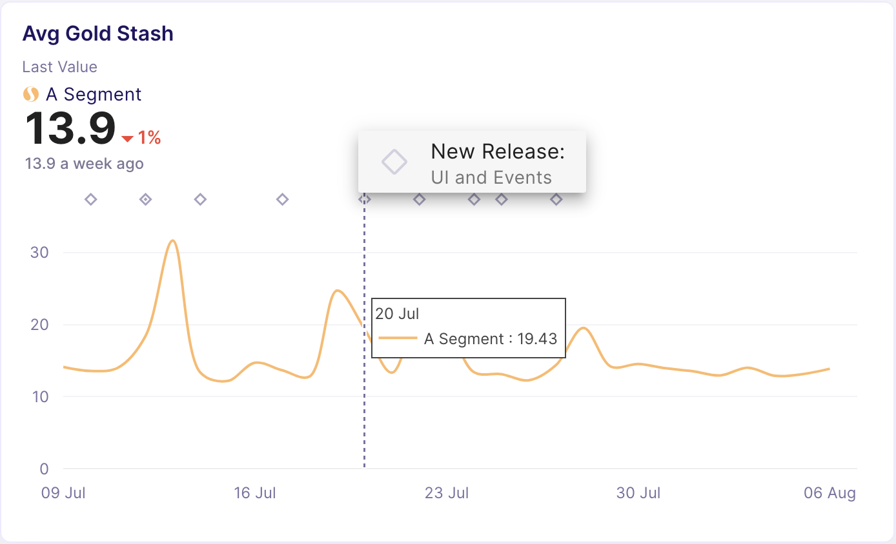

## Getting Started with Annotations

Annotations is a tool used to track all meta-events.

It's a simple calender-like tool that allows you to track releases, bugs, featuing, UA changes, Live-Ops campaigns, important Holidays and similar real-life events that could impact the product.

You see a trend in Retention metric has changed around particular date when there was a release? Time to investigate.

### Making Your First Annotation

Go to sidebar -> `Annotations`

## Annotations Page

Here you will see all the entries in a calender-like format. 

### New Annotation

To add an Annotation, click on a date or click and drag accross multiple days. A popup will open where you can fill in the details.

Set a `Name`, `Timestamp` or `Period` (you can annotate, for eg, a week), `Short description` and `Detailed description`.

Annotations are shown on any chart that has _Date_ for x-axis.

They are also displayed in a feed-like manner in the [Hub](Hub.md).

### Filtering Annotations

You can pick only tags you want to show (or to exclude) from displaying (only releases, only holidays, etc). You can do this on a dashboard level or in Full Edit Mode for individual charts.

## Annotation Best Practices

This is not a release log. Track here only the most important things that can have any chance of influencing KPIs. 

Agree with the team on the set of tags you will be using. Minimal recommended set of tags are: 

- `release` 
- `client-release`
- `server-release`
- `feature-switch` for when you remotely turn on / off part of the code
- `ua-campaign`
- `featuring`
- `holiday`
- `offer`
- `live-event`
- `bug` remember to note data tracking bugs as well
- `ab-test`,

