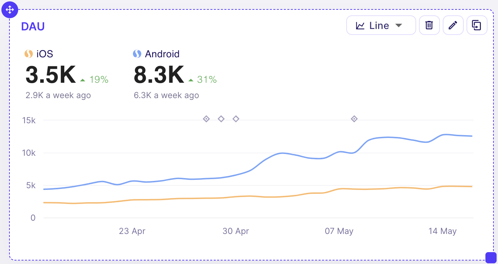

## Getting Started with Dashboards

Dashboards are designed to enable easy monitoring and quick exploratory analysis. 

### Making Your First Dashboard

Go to sidebar -> `Dashboard`

## Dashboards Page

Here you can see all the _public_ dashboards and your own private dashboards. More on that later.

## New Dashboard

Always at the first place is `KPI Explorer`. It's permanently there. Unlike (your own) dashboards that you can delete, you can only _clear_ KPI explorer. To reduce clutter we allow only one draft dashboard.

KPI Explorer is your starting point for exploring the vast game data. Whether you just want to quickly check some KPI or start building a dashboard you will be returning to check every day, you will start from here.

Click `Add Chart` at the bottom toolbar to show __KPI Picker__. If you have opened blank KPI Explorer the KPI Picker will automatically show.

There's a hint bellow KPI name. It can say:

- Daily - these show the value of a KPI from day to day, x-axis shows Date
- Cohort - these show the value of a KPI in cohort time, x-axis shows number of days that have passed since install
- Custom Events - this option is at the bottom and lets you explore real-time data directly from tracked events

Once you have added your first KPI, you can explore some options:

  - **Date Filter**
    - On the left side you have Date Filter which is set to _Last 30 Days_ by default. This is 30 days ending yesterday. It's a sliding period, so tomorrow it will show slightly different date range.
    - You can pick a custom date range and pick if _Sliding Period_ is _on_ or _off_. If the Sliding Period is on, the application will automatically move the start and the end of the period tomorrow.
    
  - **Compare Period**
    - By default it is set to _A week ago_ and _Show compare line_ is _on_; note that comparison line (dashed line) are by default shown  when there's only a single line on the chart, but they can be forced on even for multiple lines
    - It affects how % change is calculated for a metric

  - **Segments**
    - You can add another segment. Either add it by clicking on the `+` sign right from "Segments" label, or pick a saved one by clicking on the folder icon next to it.
    - __+ Filters__ allows you to define any subset of users to explore your hypothesis
    - Keep in mind that segments are recalculated for every day. So, if you are looking at DAU of payers, it's not the same group on May 1st and May 2nd and so on
    - __Group By__ enables you to further dig in the data; you can have multiple segments and break them down by some dimension all at once

  - **Add another KPI** (and another, and...)
    - Either click on `Add Chart` at the bottom of the screen, or __Clone__ existing chart
  
  - Or play with a chart...

## Charts

Currently there are two base types of charts with many variants:

- Line charts
- Bar charts

Daily KPIs have both, Cohort and Custom Event KPIs use only Line chart and it's variants.

  

Big numbers are called __Highlight Numbers__ and show Total (SUM or AVG) for the selected period for line (on line chart) or segment (on bar chart). The diff shown next to it is the relative difference between total for selected period and total for comparison period. Highlight numbers can be changed to show only the last value of the period, in which case % diff is changed as well and shows relative diff of the last value of the period compared to the last value of comparison period. Finally these can be switched off, in which case only __Color Legend__ remains.

You can grab _bottom right_ corner and _resize_ a chart. Charts are responsive and will use the space you provide them in the best possible way they can. Play around with it, same size can display data differently depending on the number of segments, groups and other factors.

If you grab _top left_ corner, you can _move_ the chart around and rearrange them on the dashboard.

Bellow Highlight Numbers, at the top of the chart are nested small diamond-shaped objects. Hover them to explore them. These are __Annotations__. You can set what happened on a specific day, add detailed description and tag it to help you better understand how changes in KPIs are affected by product changes, featuring, international holidays etc.

__Full Edit Mode__ is nested between delete and clone buttons at the top right corner. This will open the list of all the options you have for a chart, including segments and group by. Here you can override any and all of the options. Any overrided option will remain set when you change it globally. Eg. you can have one chart showing only last 7 days of data and if you change Date Filter from Last 30 days to Last 90, all the charts will show 90 data points, but this one chart will be still showing 7. You can override segments, as well as many other options.

Bar charts can have a button (with a number on it) just left from the __Chart Type__ button. This rotates available variants of the chart. 
