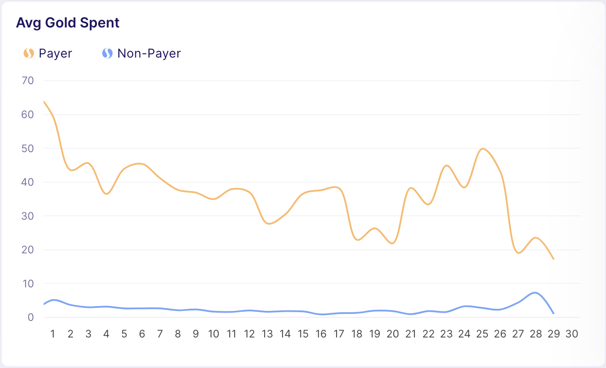

## Getting Started with Semantic Layer

Semantic Layer is used to define all the available KPIs. The definitions provide the information to the system how to query the [Data Model](DataModel.md) for the given KPI. It is pre-set for every new Game Tuner project with 150+ KPIs. This documentation will provide an introduction about the inner workings of GT Semantic Layer and continue into how you can expand the entities defined by the Semantic Layer.

## Datasources

Basic entity is a `Datasource`. Some are built-in, some are provided by out-of-the-box integrations with external data sources and you can set up your custom datasources, as well.

For most user-facing applications, including mobile games, the most important analytics is about user-level KPIs. For this purpose Game Tuner defines a Datasource called `User Entity`.

### User Entity

[User Entity](UserEntity.md) is the primary datasource which is "special" in many ways. Semantic Layer is closely coupled with [Data Model](DataModel.md) and Query Engine. User Entity has more built in options than any other Datasource.

The centerpiece of the User Entity is the table that tracks various `User Properties` for each user for each day. This is accompanied by all the user-generated events. The system is aware of the relationship between User Entity table(s) and event tables and is able to efficiently query them.

### External Data Sources

Additionally to User Entity, KPIs can be defined on any other registered data source. Data source can be any table or set of tables available to the system. Once data source is properly registered, you can define KPIs on top of it. For now, you can mix and match KPIs from different data sources, but global segments and filters will work only on a set of KPIs from one data source. Exception is Date filter that applies to all KPIs as they all must have Date dimension.

Global datasource is typically the one belonging to the first KPI you added, or in case of adding multiple KPIs at once, conflict is resolved in the following order:

- User Entity first
- Integrated Datasource if no User Entity KPI is used
- External Datasource if no Integrated Datasource KPI is used

Note that you cannot name the same two KPIs referencing different datasources. Even if both KPIs are representing, for instance, Revenue, one is coming from game data and is modeled in User Entity with all the tradeoffs based on assumptions about using that data. The other data source might pull data directly from stores and represent financial report showing the actual money in the bank. These will almost never entirely match. Data is produced by different processeses and they are modeled by different needs. So, even though both refer to revenue, we insist that they are two different KPIs with two different names.

#### Integrated Data Sources

##### AppsFlyer

There's an automated integration process with AppsFlyer data. To see how to do it, check [Integrated Data Sources](IntegratedSources.md).

We are fetching TODO data from AppsFlyer. Data is modeled to reduce internal inconsistencies, tables are registered in the Semantic Layer and a set of the most important UA related KPIs is automatically added to the system.


## Expanding User Entity

User properties can be categoriesed by two functions:

- `dimension`
- `measure`

With some having dual function as both dimension and a measure. Properties which serve the role of a dimension will be flagged accordingly and they appear in the list of available filters used to segment userbase. Properties that have the function of a measure will be used to construct a KPI.

Property can be defined directly from an event like:

TODO
```yaml
transactions_count:
  name: Transactions Count
  formula: count(*)
  from: purchase
```

or from another property:

```yaml
is_payer:
  name: Is Payer
  formula: {{total_transactions_count}} > 0
```

These properties are predefined by the system, but the same approach can be used to create new custom property:

```yaml
custom_property:
  name: Something Meaningful
  formula: sum(event_parameter)
  from: custom_event
  where: event_parameter_some_type = "Specific Value"
  default: 0
```

Once the new property is defined it will be available for all the future data. For days before it was defined the value will be NULL or whatever is set as default value.

Optionally, you can apply the transformation retroactivelly, but it can raise additional costs to your plan.

## Expanding the List of KPIs

A KPI is defined as an aggregation on top of a user property.

```python
Kpi('dau', label="DAU", formula="s",
    category="Engagement", recommended=True,
    metrics={'s': WarehouseMetric("SUM({dau})", None, 'v_user_history_daily')},
    x_axis={'date_': Rollup('AVG', 'SUM'), 
      'cohort_day': Rollup('SUM', 'SUM')}
    )
```

or

```python
Kpi('arpdau_net', label='IAP ARPDAU Net', unit=Unit.dollar(), formula="net_revenue_usd / dau",
    category="Revenue",
    metrics={
        'net_revenue_usd': WarehouseMetric("SUM({net_revenue_usd})", None, 'v_user_history_daily'),
        'dau': WarehouseMetric("SUM({dau})", None, 'v_user_history_daily'),
    },
    x_axis={'date_': Rollup('SUM', 'SUM'), 'cohort_day': Rollup('SUM', 'SUM')}),

```

Note that both metrics are defined for `date_` and `cohort_day` axis. That means they will be available to users as both daily KPI tracked from day to day and as cohort KPI tracked as number of days since the installation day. Underlying data model makes it simple to track all the KPIs for cohorts.

<center></center>

In the above example we can simply track how premium currency changes over time, N days after the registration, split for payers and non-payers.

Once a custom property is added, you can define a custom KPI(s) using it.

