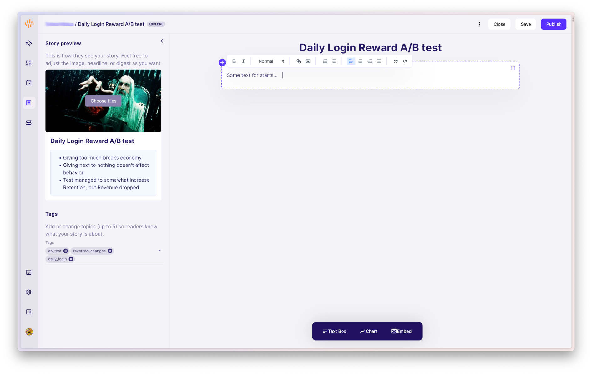
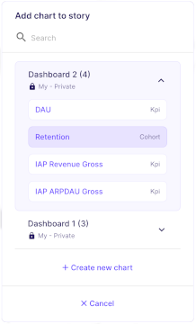

## Getting Started

Stories are a narrative one-off reports designed to enable an organization to easily share findings and analysis. Once you have a substantial number of published Stories, the tool will act as a knowledge base, allowing easy search and overview of past results.

### Making Your First Story

Go to sidebar -> `Stories`

## Stories Page

Here you will see all the Stories your Organization has created for the selected project. 

In the top left corner there's a __New Story__ slot. You cannot archive this one, only clear it. To avoid clutter, there's only one slot for work in progress. 

## New Story

Once you start writing a Story, you will notice the part on the left, named _Story Preview_. Make sure to properly set this before publishing the story, as it will influence how the Story will look like in the [Hub](./Hub.md) or Stories section. This allows an author to convey the most important results at a glance.

There are three basic types of elements you can use to make the Story. They are listed in the bottom toolbar.

!!! note
    You cannot save the empty Story. It requires at least one element added to the content and adding Story digest.

##### TextBox

This element allows adding text, doing the basic formatting, hyperlinking, adding images and code blocks. Once you add the element, the options will appear in contextual toolbar as in the above image.

##### Chart

You can create a new chart or import an existing one from one of the dashboards.

A chart is copied as-is when imported. Any subsequent changes on the original dashboard will not influence the content of the Story. Charts the full set of options in the Full Edit Mode, as in a Dashboard. 

!!!Note
    Default behavior for date filter is to have fixed period. Dashboard defaults to sliding period, but you can freely change this.

##### Embed box

Use this to embed external web content using an `<iframe>`.

###### Google Docs

You can, for instance, embed Google Slides, Google Sheets or Docs by following [this instruction](https://support.google.com/docs/answer/183965?hl=en&co=GENIE.Platform%3DDesktop) and pasting the result in the Embed box.

###### Tableau

You can simply paste the link from Tableau online project and the report will be automatically embeded. If there are no login credentials set, a login page will show up. Alternativelly, Tableau credentials can be associated with a Game Tuner account, allowing GT to automatically log in user and display Tableau content.

To set up Tableau login credentials, go to your account settings -> Integrations. Ask your Tableau Administrator to provide you `Secret Key` for your Tableau account and fill out this form.

## Publishing a Story

Once the Story is ready just click the `Publish` button at the top right of the screen.